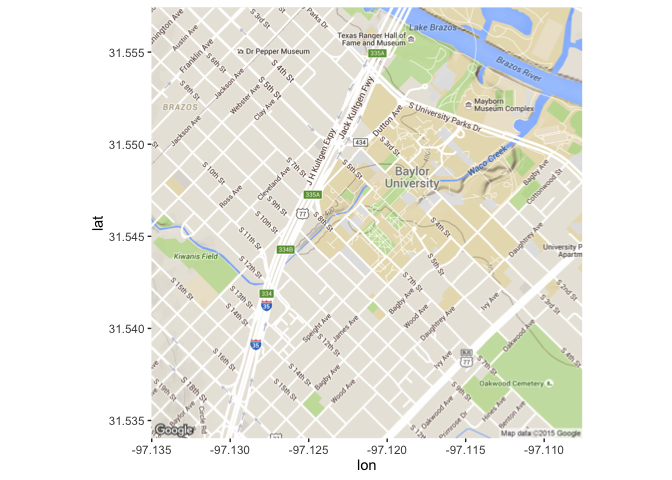
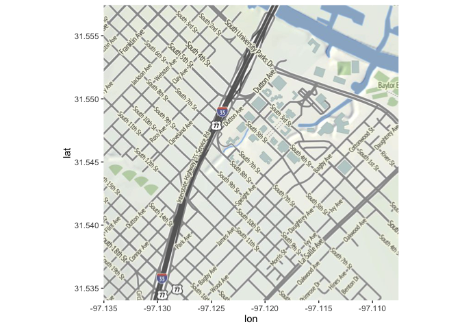
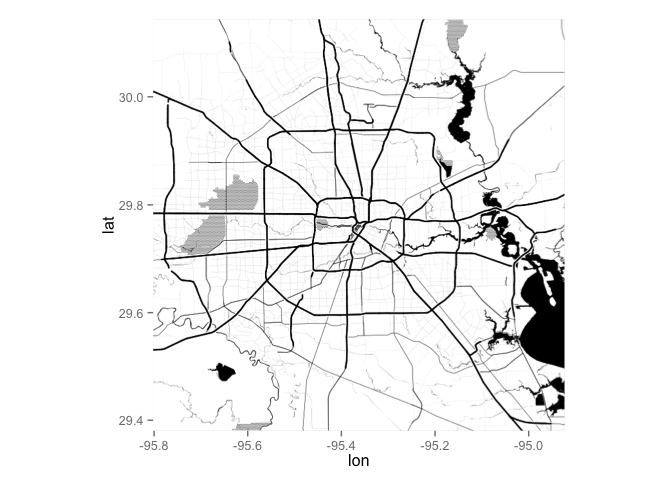
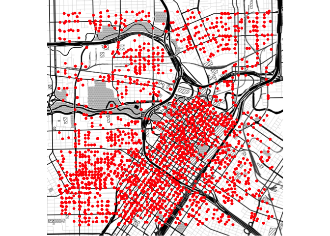
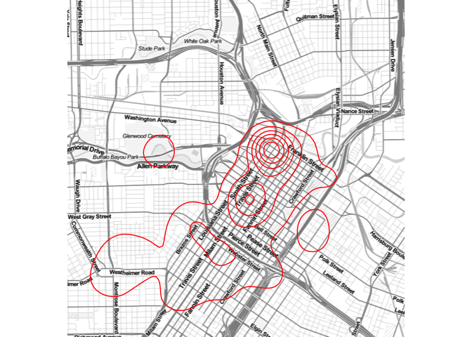

<!-- README.md is generated from README.Rmd. Please edit that file -->


ggmap
=====

ggmap makes it easy to retrieve raster map tiles from popular online mapping services like google maps, open street maps, cloudmade and stamen:

``` {.r}
library(ggmap)

ggmap(get_googlemap())
```



``` {.r}
ggmap(get_stamenmap())
```



``` {.r}
ggmap(get_stamenmap(maptype = "toner-background"))
```



Use `qmplot()` in the same way you'd use `qplot()`, but with a map automatically added in the background:

``` {.r}
downtown <- subset(crime,
  -95.39681 <= lon & lon <= -95.34188 &
   29.73631 <= lat & lat <=  29.78400
)

qmplot(lon, lat, data = downtown, maptype = "toner-background", color = I("red"))
```



``` {.r}
qmplot(lon, lat, data = downtown, maptype = "toner-lite", geom = "density2d", color = I("red"))
```



Installation
------------

-   From CRAN: `install.packages("ggmap")`

-   From Github: `devtools::install_github("dkahle/ggmap")`
