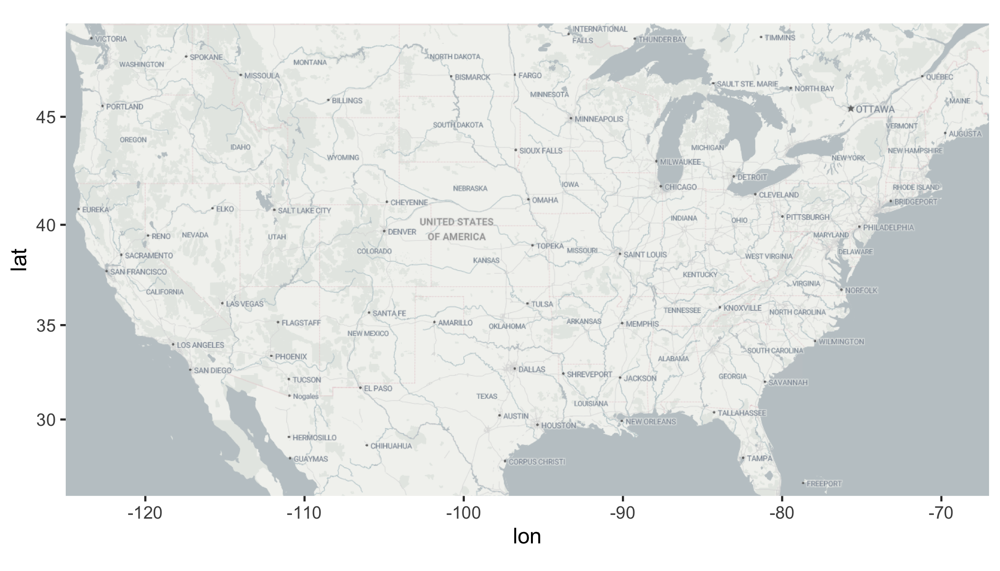
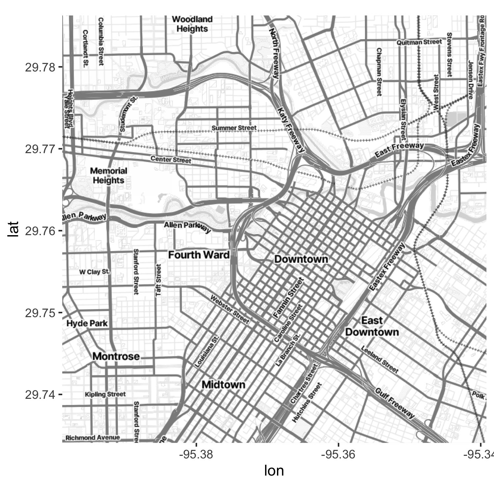
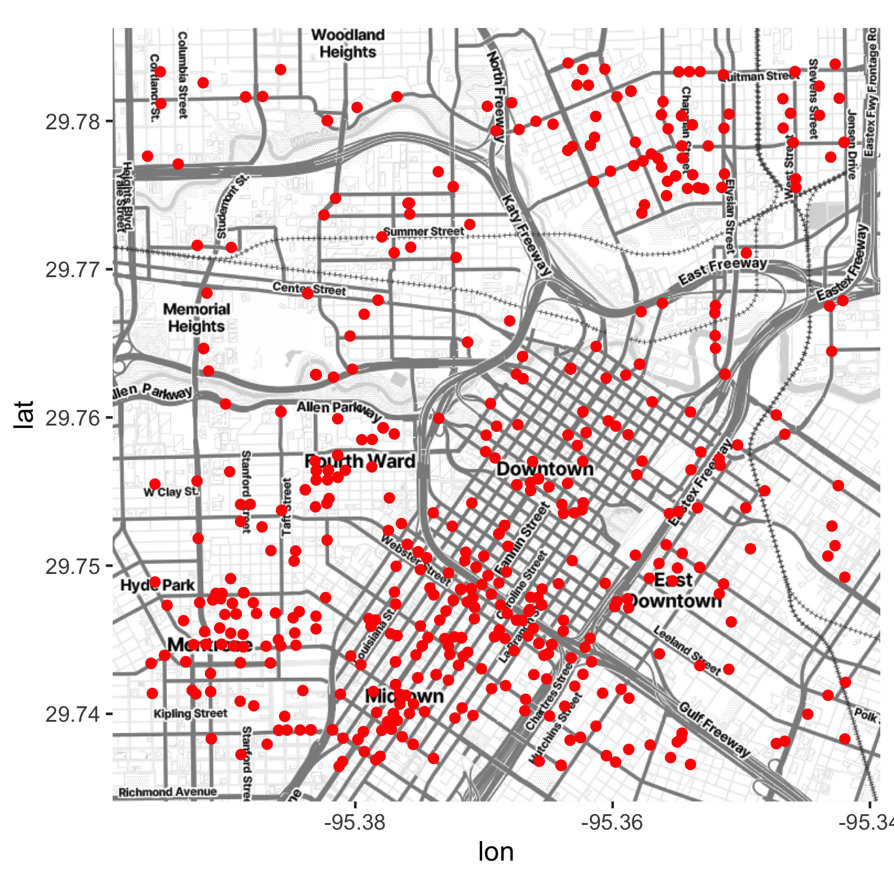
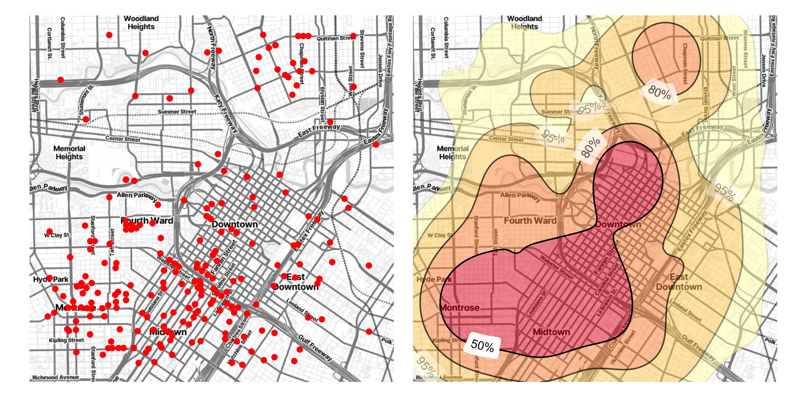
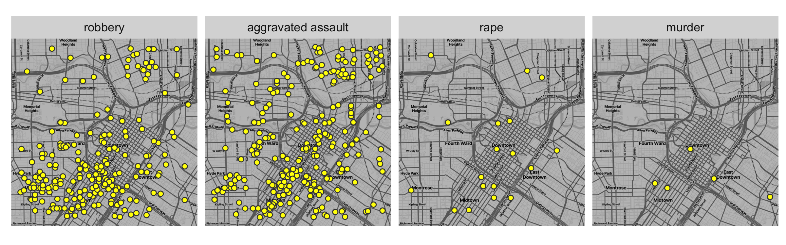

<!-- README.md is generated from README.Rmd. Please edit that file -->
<!-- badges: start -->

[](https://cran.r-project.org/package=ggmap)
[](https://ci.appveyor.com/project/dkahle/ggmap)
<!-- badges: end -->

<hr>

# ggmap

**ggmap** is an R package that makes it easy to retrieve raster map
tiles from popular online mapping services like [Google
Maps](https://developers.google.com/maps/documentation/maps-static?hl=en),
[Stadia Maps](https://stadiamaps.com/), and
[OpenStreetMap](https://www.openstreetmap.org/), and plot them using the
[**ggplot2**](https://github.com/tidyverse/ggplot2) framework.

## Stadia Maps

Stadia Maps offers map tiles in several styles, including updated [tiles
from Stamen Design](https://stadiamaps.com/stamen/). An API key is
required, but no credit card is necessary to [sign
up](https://client.stadiamaps.com/signup) and there is a free tier for
non-commercial use. Once you have your API key, invoke the registration
function: `register_stadiamaps("YOUR-API-KEY", write = FALSE)`. Note
that setting `write = TRUE` will update your `~/.Renviron` file by
replacing/adding the relevant line. If you use the former, know that
you’ll need to re-do it every time you reset R.

Your API key is *private* and unique to you, so be careful not to share
it online, for example in a GitHub issue or saving it in a shared R
script file. If you share it inadvertently, just go to
client.stadiamaps.com, delete your API key, and create a new one.

``` r
library("ggmap")
#  Loading required package: ggplot2
#  ℹ Google's Terms of Service: <https://mapsplatform.google.com>
#    Stadia Maps' Terms of Service: <https://stadiamaps.com/terms-of-service/>
#    OpenStreetMap's Tile Usage Policy: <https://operations.osmfoundation.org/policies/tiles/>
#  ℹ Please cite ggmap if you use it! Use `citation("ggmap")` for details.

us <- c(left = -125, bottom = 25.75, right = -67, top = 49)
get_stadiamap(us, zoom = 5, maptype = "alidade_smooth") |> ggmap() 
#  ℹ © Stadia Maps © Stamen Design © OpenMapTiles © OpenStreetMap contributors.
```



Use `qmplot()` in the same way you’d use `qplot()`, but with a map
automatically added in the background:

``` r
library("dplyr", warn.conflicts = FALSE)
library("forcats")

# define helper
`%notin%` <- function(lhs, rhs) !(lhs %in% rhs)

# reduce crime to violent crimes in downtown houston
violent_crimes <- crime |> 
  filter(
    offense %notin% c("auto theft", "theft", "burglary"),
    between(lon, -95.39681, -95.34188),
    between(lat, 29.73631, 29.78400)
  ) |> 
  mutate(
    offense = fct_drop(offense),
    offense = fct_relevel(offense, c("robbery", "aggravated assault", "rape", "murder"))
  )

# use qmplot to make a scatterplot on a map
qmplot(lon, lat, data = violent_crimes, maptype = "stamen_toner_lite", color = I("red"))
#  ℹ Using `zoom = 14`
#  ℹ © Stadia Maps © Stamen Design © OpenMapTiles © OpenStreetMap contributors.
```


Often `qmplot()` is easiest because it automatically computes a nice
bounding box for you without having to pre-compute it for yourself, get
a map, and then use `ggmap(map)` in place of where you would ordinarily
(in a **ggplot2** formulation) use `ggplot()`. Nevertheless, doing it
yourself is more efficient. In that workflow you get the map first (and
you can visualize it with `ggmap()`):

``` r
bbox <- make_bbox(lon, lat, data = violent_crimes)
map <- get_stadiamap( bbox = bbox, maptype = "stamen_toner_lite", zoom = 14 )
#  ℹ © Stadia Maps © Stamen Design © OpenMapTiles © OpenStreetMap contributors.
ggmap(map)
```



And then you layer on geoms/stats as you would with **ggplot2**. The
only difference is that (1) you need to specify the `data` arguments in
the layers and (2) the spatial aesthetics `x` and `y` are set to `lon`
and `lat`, respectively. (If they’re named something different in your
dataset, just put `mapping = aes(x = longitude, y = latitude))`, for
example.)

``` r
ggmap(map) +
  geom_point(data = violent_crimes, color = "red")
```



With **ggmap** you’re working with **ggplot2**, so you can add in other
kinds of layers, use
[**patchwork**](https://patchwork.data-imaginist.com), etc. All the
**ggplot2** geom’s are available. For example, you can make a contour
plot with `geom = "density2d"`:

``` r
library("patchwork")
library("ggdensity")

robberies <- violent_crimes |> filter(offense == "robbery")

points_map <- ggmap(map) + geom_point(data = robberies, color = "red")

# warnings disabled
hdr_map <- ggmap(map) + 
  geom_hdr(
    aes(lon, lat, fill = after_stat(probs)), data = robberies,
    alpha = .5
  ) +
  geomtextpath::geom_labeldensity2d(
    aes(lon, lat, level = after_stat(probs)),
    data = robberies, stat = "hdr_lines", size = 3, boxcolour = NA
  ) +
  scale_fill_brewer(palette = "YlOrRd") +
  theme(legend.position = "none")

(points_map + hdr_map) & 
  theme(axis.title = element_blank(), axis.text = element_blank(), axis.ticks = element_blank())
```



Faceting works, too:

``` r
ggmap(map, darken = .3) +
  geom_point(
    aes(lon, lat), data = violent_crimes, 
    shape = 21, color = "gray25", fill = "yellow"
  ) +
  facet_wrap(~ offense, nrow = 1) +
  theme(axis.title = element_blank(), axis.text = element_blank(), axis.ticks = element_blank())
```



## Google Maps

[Google Maps](https://cloud.google.com/maps-platform/terms/) can be used
just as easily. However, since Google Maps use a center/zoom
specification, their input is a bit different:

``` r
(map <- get_googlemap("waco texas", zoom = 12))
#  ℹ <https://maps.googleapis.com/maps/api/staticmap?center=waco%20texas&zoom=12&size=640x640&scale=2&maptype=terrain&key=xxx>
#  ℹ <https://maps.googleapis.com/maps/api/geocode/json?address=waco+texas&key=xxx>
#  1280x1280 terrain map image from Google Maps; use `ggmap::ggmap()` to plot it.
ggmap(map)
```


Moreover, you can get various different styles of Google Maps with
**ggmap** (just like Stadia Maps):

``` r
get_googlemap("waco texas", zoom = 12, maptype = "satellite") |> ggmap()
get_googlemap("waco texas", zoom = 12, maptype = "hybrid") |> ggmap()
get_googlemap("waco texas", zoom = 12, maptype = "roadmap") |> ggmap()
```

Google’s geocoding and reverse geocoding API’s are available through
`geocode()` and `revgeocode()`, respectively:

``` r
geocode("1301 S University Parks Dr, Waco, TX 76798")
#  ℹ <https://maps.googleapis.com/maps/api/geocode/json?address=1301+S+University+Parks+Dr,+Waco,+TX+76798&key=xxx>
#  # A tibble: 1 × 2
#      lon   lat
#    <dbl> <dbl>
#  1 -97.1  31.6
revgeocode(c(lon = -97.1161, lat = 31.55098))
#  ℹ <https://maps.googleapis.com/maps/api/geocode/json?latlng=31.55098,-97.1161&key=xxx>
#  Warning: Multiple addresses found, the first will be returned:
#  !   1301 S University Parks Dr, Waco, TX 76706, USA
#  !   55 Baylor Ave, Waco, TX 76706, USA
#  !   HV2M+9H Waco, TX, USA
#  !   Bear Trail, Waco, TX 76706, USA
#  !   Robinson, TX 76706, USA
#  !   Waco, TX, USA
#  !   McLennan County, TX, USA
#  !   Texas, USA
#  !   United States
#  [1] "1301 S University Parks Dr, Waco, TX 76706, USA"
```

*Note: `geocode()` uses Google’s Geocoding API to geocode addresses.
Please take care not to disclose sensitive information. [Rundle, Bader,
and Moody (2022)](https://www.ncbi.nlm.nih.gov/pmc/articles/PMC8972108/)
have considered this issue and suggest various alternative options for
such data.*

There is also a `mutate_geocode()` that works similarly to
[**dplyr**](https://github.com/tidyverse/dplyr/)’s `mutate()` function:

``` r
tibble(address = c("white house", "", "waco texas")) |> 
  mutate_geocode(address)
#  ℹ <https://maps.googleapis.com/maps/api/geocode/json?address=white+house&key=xxx>
#  ℹ <https://maps.googleapis.com/maps/api/geocode/json?address=waco+texas&key=xxx>
#  # A tibble: 3 × 3
#    address         lon   lat
#    <chr>         <dbl> <dbl>
#  1 "white house" -77.0  38.9
#  2 ""             NA    NA  
#  3 "waco texas"  -97.1  31.5
```

Treks use Google’s routing API to give you routes (`route()` and
`trek()` give slightly different results; the latter hugs roads):

``` r
trek_df <- trek("houson, texas", "waco, texas", structure = "route")
#  ℹ <https://maps.googleapis.com/maps/api/directions/json?origin=houson,+texas&destination=waco,+texas&key=xxx&mode=driving&alternatives=false&units=metric>
qmap("college station, texas", zoom = 8) +
  geom_path(
    aes(x = lon, y = lat),  colour = "blue",
    size = 1.5, alpha = .5,
    data = trek_df, lineend = "round"
  )
#  ℹ <https://maps.googleapis.com/maps/api/staticmap?center=college%20station,%20texas&zoom=8&size=640x640&scale=2&maptype=terrain&language=en-EN&key=xxx>
#  ℹ <https://maps.googleapis.com/maps/api/geocode/json?address=college+station,+texas&key=xxx>
#  Warning: Using `size` aesthetic for lines was deprecated in ggplot2 3.4.0.
#  ℹ Please use `linewidth` instead.
#  This warning is displayed once every 8 hours.
#  Call `lifecycle::last_lifecycle_warnings()` to see where this warning was
#  generated.
```


(They also provide information on how long it takes to get from point A
to point B.)

Map distances, in both length and anticipated time, can be computed with
`mapdist()`). Moreover the function is vectorized:

``` r
mapdist(c("houston, texas", "dallas"), "waco, texas")
#  ℹ <https://maps.googleapis.com/maps/api/distancematrix/json?origins=dallas&destinations=waco,+texas&key=xxx&mode=driving>
#  ℹ <https://maps.googleapis.com/maps/api/distancematrix/json?origins=houston,+texas&destinations=waco,+texas&key=xxx&mode=driving>
#  # A tibble: 2 × 9
#    from           to               m    km miles seconds minutes hours mode   
#    <chr>          <chr>        <int> <dbl> <dbl>   <int>   <dbl> <dbl> <chr>  
#  1 dallas         waco, texas 155265  155.  96.5    5303    88.4  1.47 driving
#  2 houston, texas waco, texas 298224  298. 185.    10217   170.   2.84 driving
```

## Google Maps API key

A few years ago Google has [changed its API
requirements](https://developers.google.com/maps/documentation/geocoding/usage-and-billing),
and **ggmap** users are now required to register with Google. From a
user’s perspective, there are essentially three ramifications of this:

1.  Users must register with Google. You can do this at
    <https://mapsplatform.google.com>. While it will require a valid
    credit card (sorry!), there seems to be a fair bit of free use
    before you incur charges, and even then the charges are modest for
    light use.

2.  Users must enable the APIs they intend to use. What may appear to
    **ggmap** users as one overarching “Google Maps” product, Google in
    fact has several services that it provides as geo-related solutions.
    For example, the [Maps Static
    API](https://developers.google.com/maps/documentation/maps-static/overview)
    provides map images, while the [Geocoding
    API](https://developers.google.com/maps/documentation/geocoding/overview)
    provides geocoding and reverse geocoding services. Apart from the
    relevant Terms of Service, generally **ggmap** users don’t need to
    think about the different services. For example, you just need to
    remember that `get_googlemap()` gets maps, `geocode()` geocodes
    (with Google, DSK is done), etc., and **ggmap** handles the queries
    for you. *However*, you do need to enable the APIs before you use
    them. You’ll only need to do that once, and then they’ll be ready
    for you to use. Enabling the APIs just means clicking a few radio
    buttons on the Google Maps Platform web interface listed above, so
    it’s easy.

3.  Inside R, after loading the new version of **ggmap**, you’ll need
    provide **ggmap** with your API key, a [hash
    value](https://en.wikipedia.org/wiki/Hash_function) (think string of
    jibberish) that authenticates you to Google’s servers. This can be
    done on a temporary basis with `register_google(key = "[your key]")`
    or permanently using
    `register_google(key = "[your key]", write = TRUE)` (note: this will
    overwrite your `~/.Renviron` file by replacing/adding the relevant
    line). If you use the former, know that you’ll need to re-do it
    every time you reset R.

Your API key is *private* and unique to you, so be careful not to share
it online, for example in a GitHub issue or saving it in a shared R
script file. If you share it inadvertantly, just get on Google’s website
and regenerate your key - this will retire the old one. Keeping your key
private is made a bit easier by **ggmap** scrubbing the key out of
queries by default, so when URLs are shown in your console, they’ll look
something like `key=xxx`. (Read the details section of the
`register_google()` documentation for a bit more info on this point.)

The new version of **ggmap** is now on CRAN soon, but you can install
the latest version, including an important bug fix in `mapdist()`, here
with:

``` r
if(!requireNamespace("devtools")) install.packages("devtools")
devtools::install_github("dkahle/ggmap")
```

## Installation

-   From CRAN: `install.packages("ggmap")`

-   From Github:

``` r
if (!requireNamespace("remotes")) install.packages("remotes")
remotes::install_github("dkahle/ggmap")
```
